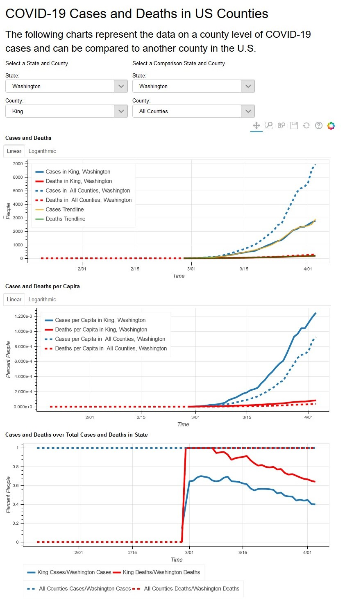

# New York Times COVID-19 Data Visualization

## Project Information
This project provides Visualizations (using a Bokeh Server) of current New York Times Covid-19 data. 

## Project Commands
Data can be updated by running `python population_stats pull_data`

Bokeh Server can be run using `bokeh serve --show main.py`

If you would like to change the default comparison county run  `bokeh serve --show main.py --args "state" "county"`

## Data Sources and Accuracy
Data used in this project is not perfect since the names of counties did not always match between the the New York Times and Census datasets.

### New York Times COVID-19 Dataset
[NYT](https://github.com/nytimes/covid-19-data) 

### US Census Dataset
[US Census Data from 2018](https://www.census.gov/data/tables/time-series/demo/popest/2010s-counties-detail.html).

## Screenshots

